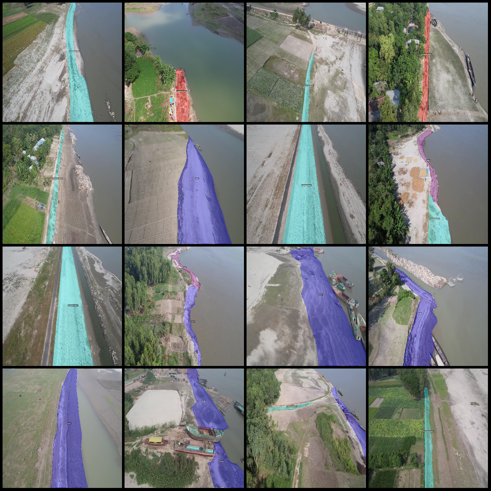
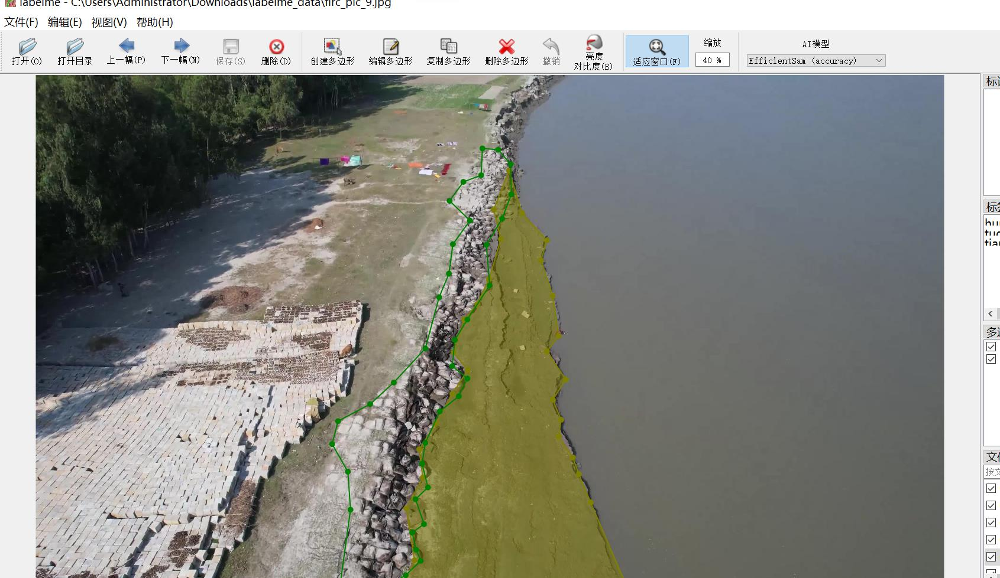

# Drone Perspective Riverbank Concrete Brick Surface Leveling and Segmentation Data Set in LabelMe Format with 349 Images

Dataset format: LabelMe format (excluding mask files, only including JPG images and corresponding JSON files)
Number of images (JPG file count): 346
Number of annotations (JSON file count): 346
Number of annotation categories: 4
Annotation category names: ["hunningtuqikuabupingzhengbiaomian", "hunningtuqikuapingzhengbiaomian", "tianranhean", "tugongdai"]
["Concrete Block Smooth Surface", "Concrete Block Uneven Surface", "Geotextile Bags", "Natural Riverbanks"]
Number of boxes for each category:
- hunningtuqikuabupingzhengbiaomian count = 77
- hunningtuqikuapingzhengbiaomian count = 146
- tianranhean count = 156
- tugongdai count = 59
Total boxes: 438

Used labeling tool: LabelMe version 5.5.0
Image resolution: 3840x2160
Annotation rules: Polygons are drawn around categories
Important note: The dataset can be edited using LabelMe, but the JSON dataset needs to be converted into either Mask or Yolo format or COCO format for instance segmentation or semantic segmentation.
Special declaration: This dataset does not guarantee any accuracy in model training or weight files.
Image previews:
Annotation example:
Original image (randomly selected 16 images):
Annotated drawing results:
## Images

Here is a pay link on Stripe ( https://buy.stripe.com/3cs8yP7sY87d0vu9AB ). Please contact me lonlonago@foxmail.com after funding $89, and I will send you a complete data files , thank you!

